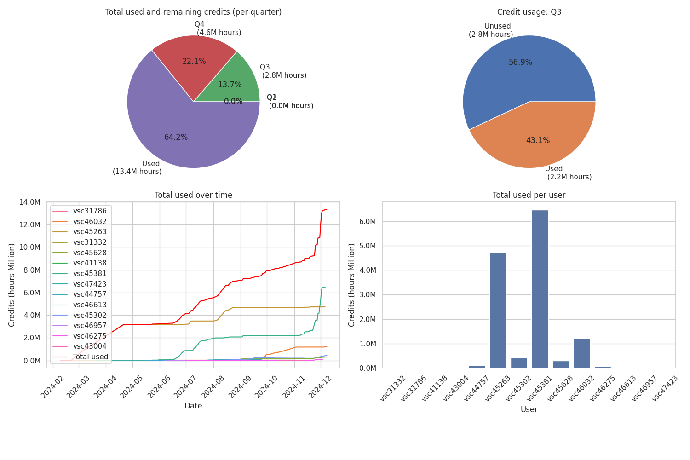

# Check compute resources usage in Storage4Climate 

A simple routine to monitor the compute credits usage of the S4C members.

Originally created by Kobe Vandelanotte [kobebryant432](https://github.com/kobebryant432) from RMIB-UGent. All kudos to him :clap:

Original github repo [VSC_ugent](https://github.com/kobebryant432/VSC_ugent). 

## Current resources state



## File number monitoring


# How to update

If not done already, clone this repository

> ```bash
> git clone git@github.com:VUB-HYDR/storage4climate.git
> ```

Move to the right directory and execute the update_usage bash script. 
> ```bash
> cd storage4climate/check_resource_usage/
> ./update_usage.sh
> ```

This will copy the csv log files for the different projects. A github workflow will try to process the csv and update the monitoring image.

> [!NOTE]  
> You need to be a moderator for all projects to access the csv log files. 


This infromation can also be checked from the VSC [resapp](https://resapp.hpc.ugent.be/).
