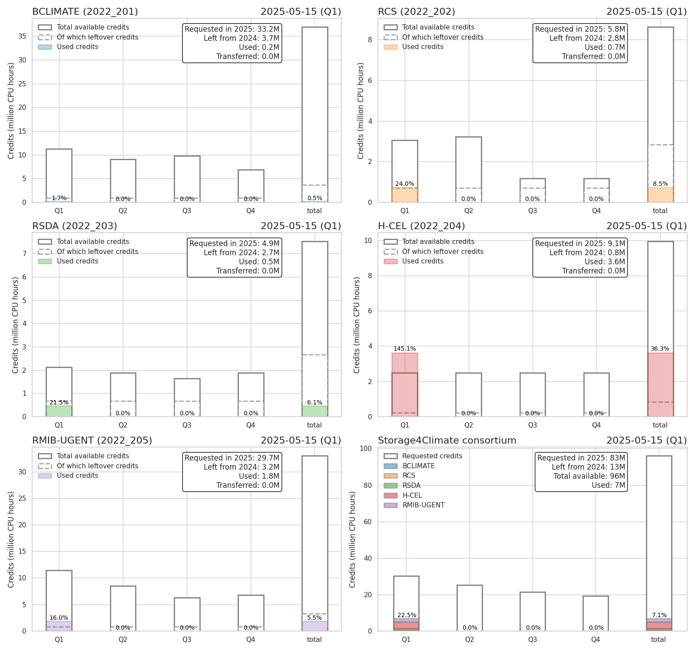

A simple routine to monitor the compute credits usage of the S4C members.

Originally created by Kobe Vandelanotte [kobebryant432](https://github.com/kobebryant432) from RMIB-UGent. All kudos to him :clap:

Original github repo [VSC_ugent](https://github.com/kobebryant432/VSC_ugent). 

# Monitoring
Date: 09/12/2024



## How to update
Download the latest log csv file from the VSC [resapp](https://resapp.hpc.ugent.be/).

> [!NOTE]  
> Only a moderator can download the log file.

Place the log file in the `VSC monitoring/input` folder and push or merge to main. 
A github workflow will try to process the csv and update the monitoring image.

> [!WARNING]
> Currently the csv log file from [resapp](https://resapp.hpc.ugent.be/) is not accessible.
>  However, the file can be found in your project folder in the hidden file .resource_app.usage.export.csv and is updated daily. Run 
> ```bash
> ./update_usage.sh $project_name
> ```
> to copy the file to the input folder and commit the changes - the monitoring image will be updated automatically.

